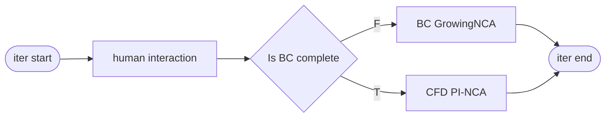

# CFD Iterative PINN

## 1. 流程設計

1. **讀取輸入**

   - 幾何與網格資訊（建築 footprint, domain mask）
   - 邊界條件（Inlet 剖面、Outlet、Wall、Top/Lateral）
   - 步行者高度取樣物理量：

     - `uped` (streamwise velocity)
     - `vped` (spanwise velocity)
     - `Uped` (wind speed magnitude)
     - `TKEped` (turbulent kinetic energy)
     - `Tuwped` (turbulent momentum flux)

     note: `uped`、`vped`、`Uped` 都是已經時間平均的

2. **邊界條件檢查 (BC check)**

   - 偵測輸入邊界是否有缺失或異常

---

## 2.BC GrowingNCA

## 3.CFD PI-NCA
